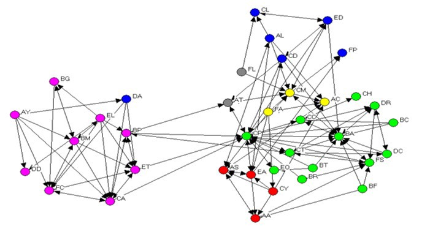
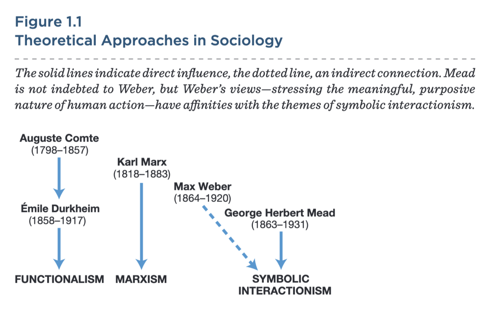
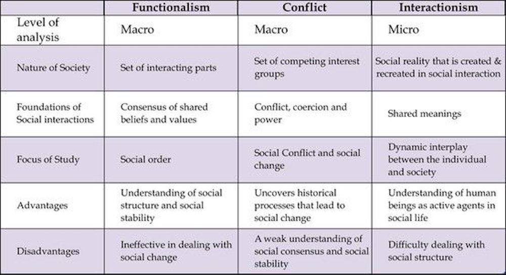

### Modern Theoretical Approaches
SOC100: Introduction to Sociology  
Brian McPhail  
Purdue University

---
### Theoretical Approaches
- broad  orientations  to  the  subject  matter  of  sociology; a set of guiding ideas
@ul
- Symbolic Interactionism
- Functionalism
- Conflict Theory
- Social Networks
@ulend

- **theory**: statements that explain a social phenomenon
---
@snap[north span-100]
### Symbolic Interactionism
@snapend
- An approach that emphasizes the role of symbols and language as core elements of human interaction.
- We develop our sense of self (our identity) through our interactions with others.
- We evaluate the complex and subtle clues we observe in our interactions with others to determine our behavior.

---
@snap[north span-100]
### Symbolic Interactionism
@snapend
- Analyzes society by addressing the *subjective* meanings that people impose on objects, events, and behaviors.

- Subjective meanings are given primacy because it is believed that people behave based on what they believe and not just on what is objectively true.

- People interpret one another’s behavior, and it is these interpretations that form the social bond.

---
@snap[north span-100]
### Symbolic Interactionism
@snapend

  

[Rich Kids of the Internet Instagram Account](https://www.instagram.com/rkoi/?hl=en)

---
@snap[north span-100]
### Functionalism
@snapend

- An approach based on the notion that social events can best be explained in terms of the functions they perform.

- Interprets each part of society in terms of how it contributes to the stability of the whole society.

---
@snap[north span-100]
### Functionalism
@snapend

- Society is like the body, which has parts (social institutions) that serve different functions and play different roles (but must work together) in creating and sustaining social order.

- Some criticize functionalism for placing too much emphasis on order and too little emphasis on conflict in society

---
@snap[north span-100]
### Conflict theory
@snapend

- An approach that states that tensions and conflicts arise when resources, status, and power are unevenly distributed between groups in society and that these conflicts become the engine for social change.

- Focuses on the role of coercion and power in producing social order.
- Conflicts premised on class, race, gender, sexuality, religion, culture, and nationality, etc.

---
@snap[north span-100]
### Conflict Theory (Marxism)
@snapend

- Class conflict is a normal feature of society.
- Individuals and groups use **power** to promote their interests.
- Powerful individuals and groups use whatever means necessary to hold on to their power (i.e, through force, rules, laws, and ideologies).

---
@snap[north span-100]
### Conflict Theory (Feminist Theory)
@snapend

@snap[west]
- An approach that emphasizes the centrality of gender in analyzing the social world and particularly the uniqueness of the experience of women

---
### Social Network Analysis
- An approach that suggests patterns of relations have consequences for individuals, groups and societies.

---

---
### Summary

---
### Opioid Crisis

---
